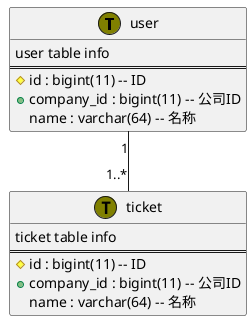

# Install
```bash
brew install python3 graphviz
python3 XXX.py
pip3 XXX
```
## Atom
```bash
brew install graphviz
brew cask install atom
apm install plantuml-viewer  
```
## IntelliJ IDEA & Chrome
```bash
brew install graphviz
plugin
```
# Create UML Diagrams

# Convert To SQL
```puml
./plantuml2mysql.py ../database.puml sampledb
```
# Reference
[plantuml2mysql](https://github.com/grafov/plantuml2mysql.git)